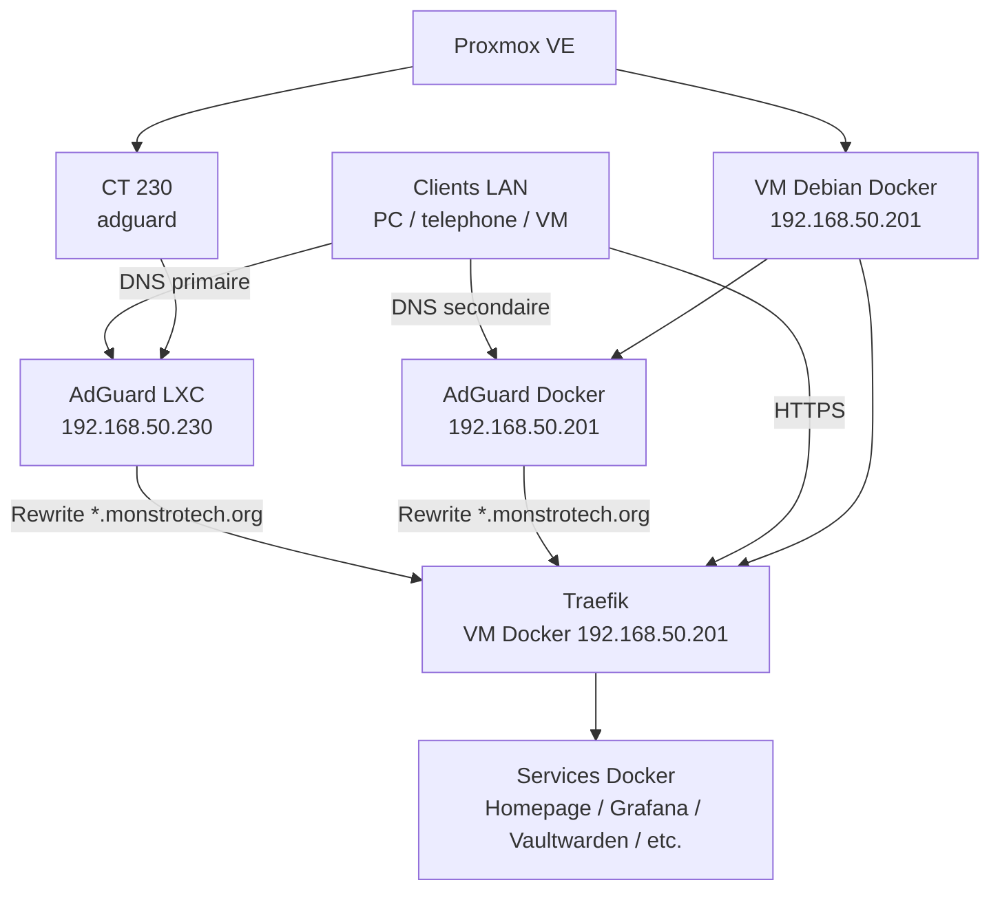

# Migration AdGuard vers LXC Proxmox

## Objectif

L'objectif est de sortir AdGuard Home de la VM Docker principale afin de rendre le DNS local plus robuste.

Avant la migration, AdGuard fonctionnait dans Docker sur la VM Debian :

```text
VM Debian Docker : 192.168.50.201
AdGuard Docker   : 192.168.50.201:3000 / 192.168.50.201:53
```

Le nouveau service AdGuard est installe dans un conteneur LXC dedie sur Proxmox :

```text
LXC AdGuard : 192.168.50.230
Interface   : http://192.168.50.230
DNS         : 192.168.50.230:53
```

Cette separation permet au DNS principal de continuer a fonctionner meme si Docker, Portainer ou la VM Debian rencontrent un probleme.

## Architecture apres migration



## Creation du LXC

Le conteneur LXC a ete cree avec le script Community Scripts Proxmox pour AdGuard Home :

```bash
bash -c "$(curl -fsSL https://raw.githubusercontent.com/community-scripts/ProxmoxVE/main/ct/adguard.sh)"
```

Pour plus de securite, il est aussi possible de telecharger le script avant execution :

```bash
curl -fsSL https://raw.githubusercontent.com/community-scripts/ProxmoxVE/main/ct/adguard.sh -o adguard.sh
nano adguard.sh
bash adguard.sh
```

Parametres choisis pour le LXC :

| Parametre | Valeur |
|---|---|
| Container ID | `230` |
| Hostname | `adguard` |
| Bridge | `vmbr0` |
| IPv4 | `192.168.50.230/24` |
| IPv6 | `none` |
| CPU | `1 core` |
| RAM | `512 MiB` |
| Disque | `4 GB` |
| Timezone | `Europe/Paris` |
| Protection | `No` pendant l'installation |

Choix IPv6 :

```text
none - No IPv6 assignment
```

Le mode `disable` a ete evite car il peut casser certains services. Le mode `none` laisse IPv6 disponible au niveau systeme, sans adresse assignee au conteneur.

## Configuration initiale AdGuard

Pendant l'assistant d'installation AdGuard :

```text
Admin Web Interface
Listen interface : All interfaces
Port             : 80
```

L'interface web est donc accessible via :

```text
http://192.168.50.230
```

Configuration DNS :

```text
DNS Server
Listen interface : All interfaces
Port             : 53
```

Le serveur DNS du LXC est donc :

```text
192.168.50.230
```

Cette configuration ne cree pas de conflit avec l'ancien AdGuard Docker, car les deux services n'utilisent pas la meme IP :

```text
AdGuard Docker : 192.168.50.201:53 et 192.168.50.201:3000
AdGuard LXC    : 192.168.50.230:53 et 192.168.50.230:80
```

Un conflit de port apparait uniquement si deux services ecoutent sur la meme IP et le meme port.

## DNS rewrites

Le LXC AdGuard doit rediriger les noms locaux vers la VM Docker qui heberge Traefik :

```text
*.monstrotech.org -> 192.168.50.201
```

Traefik reste sur la VM Docker :

```text
Traefik : 192.168.50.201 ports 80/443
```

Le role d'AdGuard est uniquement de resoudre le nom vers l'IP de Traefik. Il n'a pas besoin d'etre dans le meme reseau Docker que Traefik.

Flux de resolution :

```text
Client demande homepage.monstrotech.org
        ↓
AdGuard LXC repond 192.168.50.201
        ↓
Client contacte Traefik en HTTPS
        ↓
Traefik route vers le bon container Docker
```

## Tests effectues

Test de resolution avec le nouveau DNS LXC :

```bash
nslookup homepage.monstrotech.org 192.168.50.230
```

Resultat obtenu :

```text
Server:  192.168.50.230
Address: 192.168.50.230#53

Name:    homepage.monstrotech.org
Address: 192.168.50.201
```

Ce resultat confirme que le LXC AdGuard resout correctement les domaines `monstrotech.org` vers la VM Docker / Traefik.

Autres tests recommandes :

```bash
nslookup grafana.monstrotech.org 192.168.50.230
nslookup vault.monstrotech.org 192.168.50.230
nslookup google.com 192.168.50.230
```

Le Query Log AdGuard LXC montre bien des requetes traitees et des domaines locaux en `Rewritten`, par exemple :

```text
homepage.monstrotech.org -> Rewritten -> 192.168.50.201
vault.monstrotech.org    -> Rewritten -> 192.168.50.201
```

## Bascule DNS

La configuration finale actuelle est :

```text
DNS principal   : 192.168.50.230  AdGuard LXC
DNS secondaire  : 192.168.50.201  AdGuard Docker
```

L'ancien AdGuard Docker reste actif comme secours.

Ancienne configuration :

```text
DNS principal : 192.168.50.201  AdGuard Docker
```

Nouvelle configuration :

```text
DNS principal  : 192.168.50.230  LXC dedie
DNS secondaire : 192.168.50.201  Docker rollback
```

## Ajout dans Homepage

Le LXC AdGuard a ete ajoute dans Homepage comme service d'infrastructure.

Exemple d'entree :

```yaml
- AdGuard LXC:
    href: http://192.168.50.230
    description: DNS principal
    icon: https://cdn.jsdelivr.net/gh/homarr-labs/dashboard-icons/svg/adguard-home.svg
    widget:
      type: adguard
      url: http://192.168.50.230
      username: USER
      password: PASSWORD
```

Comme le LXC n'est pas un container Docker de la VM Debian, l'URL du widget utilise directement l'IP du LXC :

```text
http://192.168.50.230
```

## Rollback

En cas de probleme avec le LXC AdGuard :

1. Remettre le DNS principal sur `192.168.50.201`.
2. Verifier que l'ancien container AdGuard Docker est actif.
3. Tester la resolution DNS.

Commandes utiles cote Docker :

```bash
docker ps | grep adguard
docker start adguard
docker logs adguard --tail=50
```

Test DNS :

```bash
nslookup homepage.monstrotech.org 192.168.50.201
nslookup google.com 192.168.50.201
```

## Points de surveillance

Pendant quelques jours, surveiller :

- Query Log du LXC AdGuard ;
- Query Log de l'ancien AdGuard Docker ;
- resolution de `*.monstrotech.org` ;
- disponibilite des services dans Uptime Kuma ;
- acces a Homepage, Grafana, Vaultwarden, Traefik et PatchMon ;
- comportement des clients du reseau.

## Conclusion

La migration place AdGuard dans un LXC dedie, plus independant de la VM Docker. Le DNS principal du reseau ne depend donc plus directement de Docker.

Etat actuel :

```text
AdGuard LXC    : DNS principal
AdGuard Docker : DNS secondaire / rollback
Traefik        : reste sur la VM Docker 192.168.50.201
```

Cette architecture est plus robuste, car le DNS local reste disponible meme si la stack Docker principale rencontre un incident.

## Liens Obsidian

- [Adguard Homelab](/pages/notes/adguard-homelab.md)
- [Adguard](/pages/notes/adguard.md)
- AdGuard Home
- [Traefik Homelab](/pages/notes/traefik-homelab.md)
- Homelab MonstroTech - Documentation TSSR
